 

# 🚀 Boss Baby AI - 창업 지원 통합 플랫폼

<div align="center">


**RAG 기반 창업 지원 정보 제공 + 사업계획서 AI 분석 + 일정 관리 통합 플랫폼**

[프로젝트 소개](#-프로젝트-소개) • [팀 소개](#-팀-소개) • [주요 기능](#-주요-기능) • [시스템 아키텍처](#️-시스템-아키텍처) • [시작하기](#-시작하기) 

</div>

---

## 💻 팀 소개

<div align="center">

<table>
  <tr>
    <td align="center">
      <br/>
      <b>김태빈</b><br/>
      <sub>Data & Testing</sub>
    </td>
    <td align="center">
      <br/>
      <b>정래원 (팀장)</b><br/>
      <sub>Frontend & UI/UX</sub>
    </td>
    <td align="center">
      <br/>
      <b>최소영</b><br/>
      <sub>Backend & RAG System</sub>
    </td>
    <td align="center">
      <br/>
      <b>최유정</b><br/>
      <sub>Database & API</sub>
    </td>
  </tr>
</table>

</div>

---

## 📌 프로젝트 소개

**Boss Baby AI**는 RAG(Retrieval-Augmented Generation) 기술을 활용하여 예비 창업자와 초기 스타트업에게 맞춤형 정보를 제공하는 올인원 AI 창업 지원 플랫폼입니다.

### 🎯 프로젝트 목표

- 15,510개의 창업 관련 문서를 벡터화하여 정확한 정보 검색
- Query Transformation과 Multi-Query 기법으로 검색 정확도 향상
- 웹 검색 Fallback으로 최신 정보까지 커버
- AI 기반 사업계획서 분석으로 전문가 수준의 피드백 제공
- 창업 일정 관리 캘린더로 지원사업 마감일 추적
- Django + FastAPI + MySQL 통합 아키텍처로 안정적인 서비스 제공

### 🏆 주요 성과

- **검색 정확도**: 92.8% (목표 90% 초과 달성)
- **평균 응답 시간**: 4.42초 (목표 5초 이내)
- **Multi-Query 효과**: 재현율 30% 향상
- **데이터 규모**: 15,510개 벡터 문서

---

## ✨ 주요 기능

### 🤖 1. RAG 기반 질의응답
- **15,510개 문서** 검색 (지원사업, 공간, 법령, 사례, 프로그램, 매뉴얼, 통계)
- **Query Transformation**: 대화 히스토리 기반 질문 재구성
- **Multi-Query**: 3개의 다양한 검색 쿼리 자동 생성
- **관련성 검증**: LLM 기반 문서 관련성 체크
- **3-Way Branching**: 내부 RAG → 웹 검색 → AI Fallback

### 📊 2. 사업계획서 AI 분석
- **20년 경력 벤처투자 전문가** 페르소나 기반 분석
- **8개 분석 섹션**: 
  - 시장 동향 분석
  - 실현 가능성 평가
  - 강점 3가지 도출
  - 약점 3가지 지적
  - 리스크 3가지 경고
  - 개선 제안 (단기/중기/장기 로드맵)
  - 종합 의견
- **사업계획서 CRUD**: 생성, 조회, 수정, 삭제

### 📅 3. 창업 일정 관리 캘린더
- **월간 캘린더 뷰**: 직관적인 그리드 레이아웃
- **일정 타입**: 
  - 🔌 캘린더 기록 : 행사 일정
- **D-Day 자동 계산**: 
  - D-3 이하: 🔴 빨강 (긴급)
  - D-7 이하: 🟡 노랑 (주의)
  - D-7 초과: 🟢 초록 (여유)
- **일정 관리**: 완료 체크, 삭제, 다가오는 일정 리스트
- **시각적 강조**: 오늘 날짜 하이라이트, 일요일/토요일 색상 구분
- **일정 자동 추출**: AI가 답변에서 날짜 정보를 자동으로 인식하여 일정 제안

### 🌐 4. 웹 검색 Fallback
- 내부 문서에 없는 정보는 Tavily API로 웹 검색
- 최신 스타트업 트렌드 및 뉴스 정보 제공
- 100% 커버리지 보장

### 💬 5. 대화 관리
- 세션 기반 대화 히스토리 유지
- MySQL 기반 채팅 기록 영구 저장
- 컨텍스트를 고려한 연속 대화
- 최근 50개 메시지 조회

### 🔐 6. 사용자 인증
- 회원가입 / 로그인
- Django 기본 인증 시스템
- 사용자별 채팅 세션 관리
- 마이페이지 (통계, 최근 활동)

---

## 🏗️ 시스템 아키텍처

```
┌─────────────────────────────────────────────────────────────┐
│                   Client (Browser)                          │
│  ┌──────────┐  ┌────────┐  ┌──────────┐  ┌──────────────┐   │
│  │ 채팅 UI  │  │ 캘린더 │  │사업계획서 │  │  마이페이지   │  │
│  └──────────┘  └────────┘  └──────────┘  └──────────────┘   │
└────────────────────────┬────────────────────────────────────┘
                         │ HTTP Request
┌────────────────────────▼────────────────────────────────────┐
│              Frontend (Django 4.2) - Port 8001              │
│  ┌──────────────┐  ┌──────────┐  ┌────────────────────────┐ │
│  │ 회원가입/로그인 │    템플릿    │    세션 관리 & 라우팅   │ │
│  └──────────────┘  └──────────┘  └────────────────────────┘ │
└────────────────────────┬────────────────────────────────────┘
                         │ REST API (JSON)
┌────────────────────────▼────────────────────────────────────┐
│         Backend (FastAPI + LangChain) - Port 8000           │
│  ┌─────────────────────────────────────────────────────────┐│
│  │ RAG Pipeline (6단계)                                    ││
│  │  1. Contextualize Q  → 2. Query Transformation          ││
│  │  3. Multi-Query (x3) → 4. Vector Search (k=10)          ││
│  │  5. Relevance Check  → 6. Answer Generation (3-Way)     ││
│  └─────────────────────────────────────────────────────────┘│
│  ┌─────────────────────┐  ┌───────────────────────────────┐ │
│  │사업계획서 AI 분석 API │  │  캘린더 API (CRUD + D-Day)    ││
│  │- 5개 점수 계산       │  │  - GET /api/calendar/events/  ││
│  │- 8개 섹션 분석       │  │  - PATCH /toggle/             ││
│  │- 20년 경력 페르소나  │  │  - DELETE /delete/            ││
│  └─────────────────────┘  └───────────────────────────────┘│
└──────┬──────────┬──────────┬──────────┬──────────┬─────────┘
       │          │          │          │          │
    ┌──▼──────┐ ┌▼────────┐ ┌▼──────┐ ┌▼──────┐ ┌▼──────┐
    │  MySQL  │ │ChromaDB │ │OpenAI │ │Tavily │ │OpenAI │
    │(운영 DB)│ │(Vector) │ │GPT-4o │ │(Web)  │ │(Embed)│
    │- users  │ │15,510개 │ │-mini  │ │Search │ │-3-small│
    │- chats  │ │ chunks  │ │       │ │       │ │       │
    │- biz    │ │         │ │       │ │       │ │       │
    │- calendar│ │        │ │       │ │       │ │       │
    └─────────┘ └─────────┘ └───────┘ └───────┘ └───────┘
```

### 📦 기술 스택

**Frontend**
- Django 4.2 (템플릿 엔진)
- HTML5, CSS3, JavaScript (Vanilla)
- Boss Baby 테마

**Backend**
- FastAPI 0.104 (비동기 API 서버)
- LangChain 0.1 (RAG 파이프라인)
- Python 3.12.x

**AI/ML**
- OpenAI GPT-4o-mini (LLM)
- OpenAI text-embedding-3-small (1536차원 임베딩)
- Tavily API (웹 검색)

**Database**
- MySQL 8.0 (운영: 사용자, 채팅, 사업계획서, 캘린더)
- SQLite (개발/테스트)
- ChromaDB (벡터 스토어)

**DevOps**
- Docker & Docker Compose (컨테이너화)
- GitHub (버전 관리)

---

## 📊 데이터 구성

### 벡터 데이터베이스 (ChromaDB)

| 카테고리 | 문서 수 | 청킹 크기 | Overlap | 설명 |
|---------|---------|----------|---------|------|
| announcement | 159 | 400 chars | 80 | K-Startup 지원사업 공고 |
| space | 14,134 | 200 chars | 30 | 전국 창업 공간 정보 |
| law | 1 | 700 chars | 120 | 중소기업창업 지원법 |
| cases | 1 | 450 chars | 70 | 창업 실패 및 재도전 사례 |
| program | 103 | 300 chars | 50 | 스타트업 지원 프로그램 |
| ip_manual | 356 | 350 chars | 60 | 지식재산권 관리 매뉴얼 |
| stat | 25 | 500 chars | 80 | 창업 통계 자료 |
| **총계** | **15,510** | - | - | - |

### MySQL 데이터베이스 스키마

#### users (사용자)
```sql
CREATE TABLE users (
    user_id INT PRIMARY KEY AUTO_INCREMENT,
    email VARCHAR(100) UNIQUE NOT NULL,
    password_hash VARCHAR(255) NOT NULL,
    created_at DATETIME DEFAULT CURRENT_TIMESTAMP
);
```

#### chat_sessions (채팅 세션)
```sql
CREATE TABLE chat_sessions (
    session_id INT PRIMARY KEY AUTO_INCREMENT,
    user_id INT,
    created_at DATETIME DEFAULT CURRENT_TIMESTAMP,
    updated_at DATETIME DEFAULT CURRENT_TIMESTAMP ON UPDATE CURRENT_TIMESTAMP,
    FOREIGN KEY (user_id) REFERENCES users(user_id)
);
```

#### chat_log (채팅 기록)
```sql
CREATE TABLE chat_log (
    id INT PRIMARY KEY AUTO_INCREMENT,
    session_id INT,
    role ENUM('user', 'assistant') NOT NULL,
    content TEXT NOT NULL,
    source_type ENUM('internal-rag', 'web-search', 'fallback'),
    created_at DATETIME DEFAULT CURRENT_TIMESTAMP,
    FOREIGN KEY (session_id) REFERENCES chat_sessions(session_id)
);
```

#### calendar_events (일정 관리)
```sql
CREATE TABLE calendar_events (
    id INT PRIMARY KEY AUTO_INCREMENT,
    user_id INT,
    title VARCHAR(200) NOT NULL,
    event_date DATE NOT NULL,
    event_type ENUM('deadline', 'start') DEFAULT 'deadline',
    is_completed BOOLEAN DEFAULT FALSE,
    created_at DATETIME DEFAULT CURRENT_TIMESTAMP,
    FOREIGN KEY (user_id) REFERENCES users(user_id),
    INDEX idx_event_date (event_date),
    INDEX idx_user_id (user_id)
);
```

---

## 🚀 시작하기

### 📋 사전 요구사항

- Python 3.10 이상
- MySQL 8.0 이상
- OpenAI API Key
- Tavily API Key (선택사항)
- Docker Desktop (Docker 사용 시)

## 📁 프로젝트 구조

```
SKN20-4th-4TEAM/
├── backend/                        # FastAPI 백엔드
│   ├── app.py                      # FastAPI 메인 서버 (RAG + 분석 + 캘린더)
│   ├── database.py                 # MySQL 연결 및 ORM
│   ├── main_chunking.py            # 문서 청킹 처리
│   ├── build_vector_db.py          # ChromaDB 구축
│   ├── prompts.py                  # 프롬프트 템플릿 (5가지)
│   ├── chunked_documents.pkl       # 청킹된 문서 (생성 파일)
│   ├── chroma_startup_all/         # ChromaDB 저장소 (생성 폴더)
│   ├── .env                        # 환경 변수 (직접 생성)
│   └── Dockerfile                  # Docker 이미지 빌드 파일
├── data/                           # 원본 데이터
│   ├── dataset.json                # 통합 JSON 데이터
│   ├── 중소기업창업_지원법.txt      # 법령 데이터
│   ├── failure_cases_all.txt       # 실패 사례
│   ├── 스타트업지원프로그램txt/     # 프로그램 데이터
│   └── 지식재산관리매뉴얼txt/       # IP 매뉴얼
├── chat/                           # Django 앱
│   ├── views.py                    # Django 뷰 (채팅, 캘린더, 사업계획서)
│   ├── models.py                   # DB 모델
│   ├── urls.py                     # URL 라우팅
│   └── templates/                  # HTML 템플릿
│       ├── chat.html               # 채팅 UI
│       ├── my_calendar.html        # 캘린더 UI
│       ├── business_plan_*.html    # 사업계획서 관련
│       ├── mypage.html             # 마이페이지
│       └── login.html              # 로그인/회원가입
├── config/                         # Django 설정
│   ├── settings.py                 # Django 설정
│   └── urls.py                     # 메인 URL
├── static/                         # 정적 파일
│   ├── css/
│   ├── js/
│   └── img/                        # Boss Baby 캐릭터 이미지
├── docker-compose.yml              # Docker Compose 설정
├── requirements.txt                # 프로젝트 전체 의존성
├── .gitignore                      # Git 제외 파일
├── .dockerignore                   # Docker 제외 파일
└── README.md                       # 프로젝트 문서
```

---

## 🎨 주요 화면

### 1. 로그인/회원가입
- 사무실 배경과 캐릭터 이미지 
- Boss Baby 로고
- 탭 전환 UI
- 실시간 유효성 검증
<table>
<tr>
  <td align="center" width="50%">
    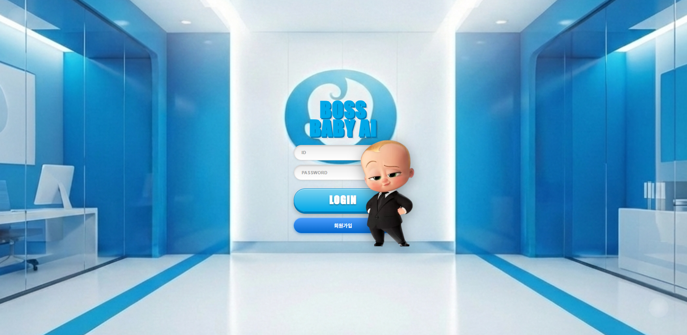<br>
    <sub><b>첫화면</b></sub>
  </td>
  <td align="center" width="50%">
    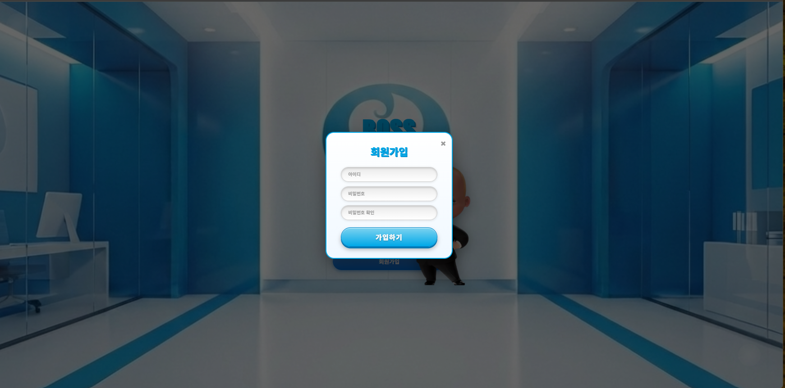<br>
    <sub><b>회원가입창</b></sub>
  </td>
</tr>
</table>

### 2. 채팅 메인
- Boss Baby 캐릭터 (우측 하단)
- 질문/답변 말풍선 UI
- 출처 배지: 📚 내부 문서 / 🌐 웹 검색 / 💭 AI 지식
- 빠른 답변 4개 (인기 질문)
- 서버 상태 표시 (실시간 연결 확인)
- 로딩 인디케이터 (타이핑 애니메이션)
- 자동 스크롤
- **일정 자동 추출**: AI가 답변에서 날짜를 감지하여 캘린더 일정 제안
<table>
<tr>
  <td align="center" width="50%">
    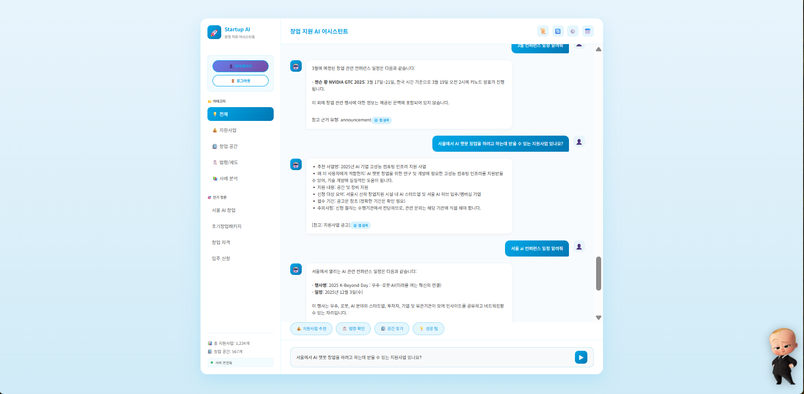<br>
    <sub><b>채팅화면</b></sub>
  </td>
  <td align="center" width="50%">
    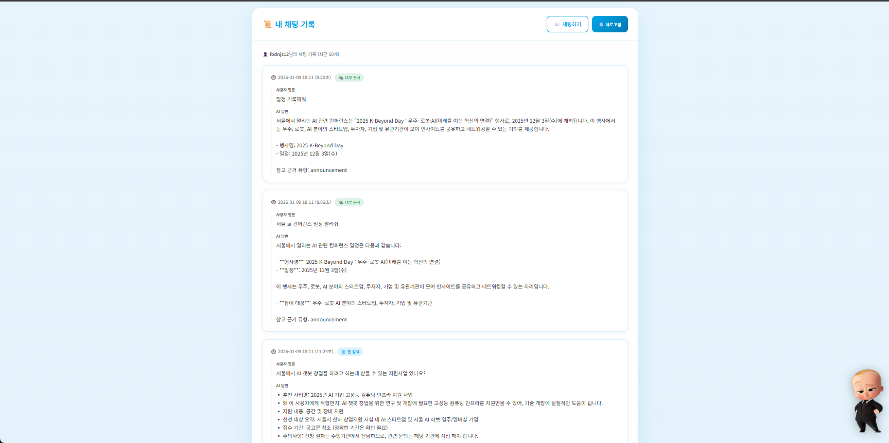<br>
    <sub><b>채팅기록</b></sub>
  </td>
</tr>
</table>

### 3. 캘린더 일정 관리
- **월간 캘린더**: 42칸 그리드 (6주)
- **일정 배지**: 
  - 🔌 일정 (빨강)
- **오늘 날짜 강조**: 파란색 그라데이션
- **다가오는 일정 리스트**: D-Day 계산
- **일정 관리 버튼**: 완료/삭제
- **월 이동**: 이전/다음 달 네비게이션
- **"오늘" 버튼**: 현재 월로 이동
<table>
<tr>
  <td align="center" width="50%">
    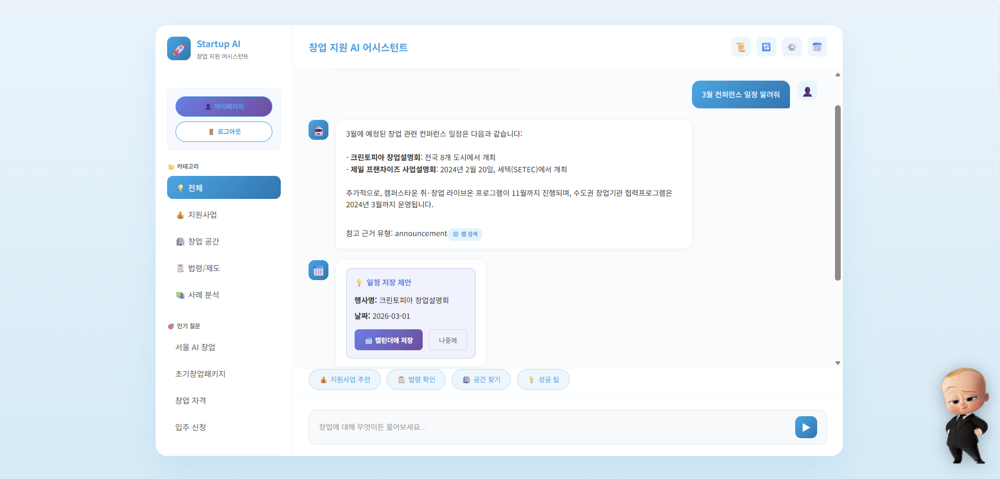<br>
    <sub><b>캘린더에 추가</b></sub>
  </td>
  <td align="center" width="50%">
    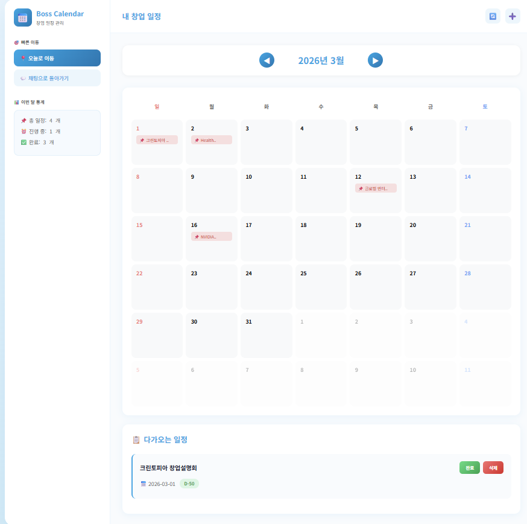<br>
    <sub><b>캘린더 </b></sub>
  </td>
</tr>
</table>

### 4. 사업계획서 관리
- **목록 화면**: 카드형 레이아웃, 완성도 바
- **작성 화면**: 멀티 섹션 폼 (7개 입력 필드)
- **상세 화면**: 편집 가능, AI 분석 버튼
- **분석 결과 화면**: 
  - 5개 점수 카드 (투자매력도, 시장성, 실현가능성, 차별성, 완성도)
  - 8개 분석 섹션 (강점, 약점, 리스크, 개선 제안)
  - 탭 UI (단기/중기/장기 로드맵)
<table>
<tr>
  <td align="center" width="33%">
    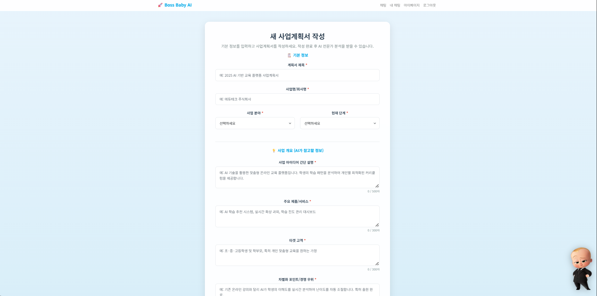<br>
    <sub><b>사업계획서작성</b></sub>
  </td>
  <td align="center" width="33%">
    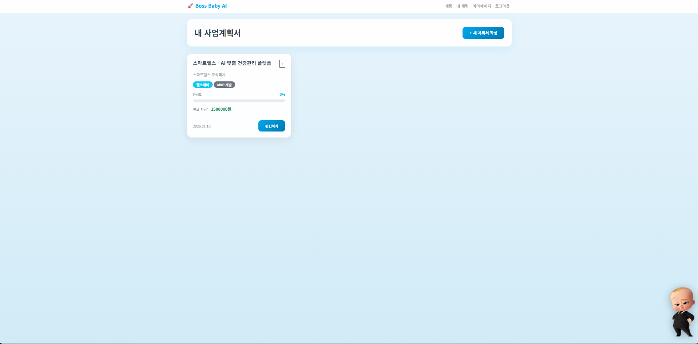<br>
    <sub><b>사업계획서</b></sub>
  </td>
  <td align="center" width="33%">
    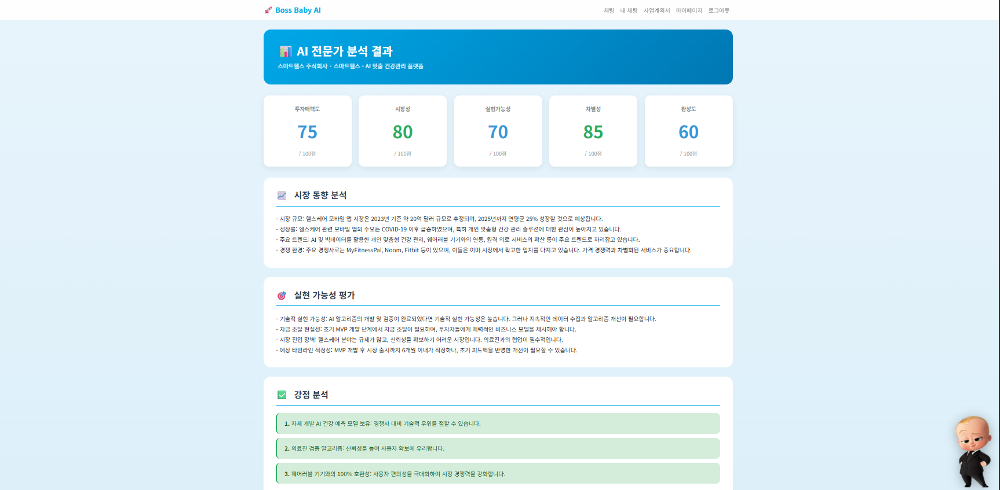<br>
    <sub><b>분석결과</b></sub>
  </td>
</tr>
</table>
<table>
<tr>
  <td align="center" width="50%">
    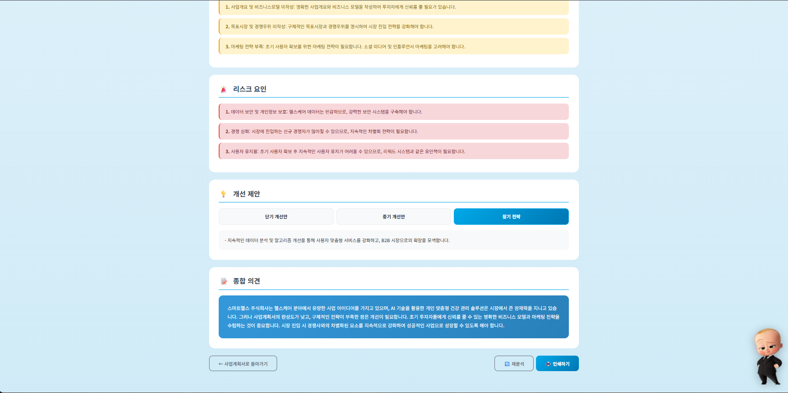<br>
    <sub><b>개선사안제안</b></sub>
  </td>
  <td align="center" width="50%">
    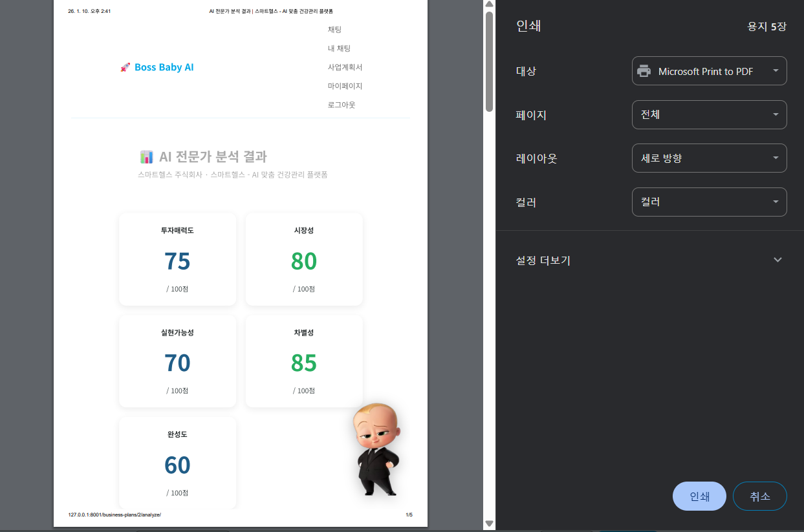<br>
    <sub><b>AI전문가분석결과</b></sub>
  </td>
</tr>
</table>

### 5. 마이페이지
- 통계 카드 (총 상담 수, 사업계획서 수, 일정 수)
- 빠른 액션 (새 상담, 사업계획서 작성, 일정 보기)
- 최근 사업계획서 목록
- 최근 상담 목록
- 다가오는 일정 미리보기
<table>
<tr>
  <td align="center" width="50%">
    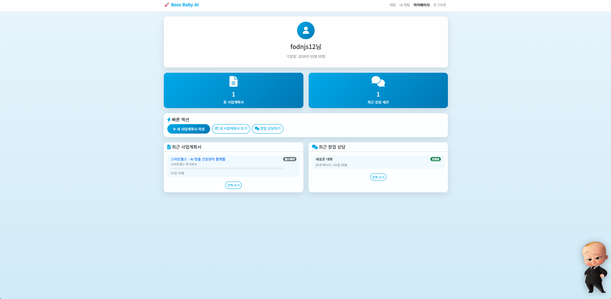<br>
    <sub><b>개인정보</b></sub>
  </td>
</tr>
</table>

---

## 🔄 RAG 파이프라인 (6단계)

### 1단계: Contextualize Question
- 대화 히스토리 기반 질문 재구성
- 이전 대화를 고려하여 독립적인 질문으로 변환
- LangChain의 `MessagesPlaceholder` 활용
- 예: "7년 후에도?" → "창업 후 7년이 지난 사업자도 창업자로 인정되는가?"

### 2단계: Query Transformation
- LLM 기반 쿼리 최적화
- 모호한 표현 명확화
- 검색에 적합한 키워드 추출
- 불필요한 조사 및 어미 제거

### 3단계: Multi-Query Generation
- 단일 질문을 3개의 다양한 쿼리로 확장
- 검색 재현율 30% 향상
- **연도 자동 보정**: "3월" → "2026년 3월"
- 예: "서울 AI 창업" → ["서울 인공지능 스타트업", "수도권 AI 기업 지원", "서울시 기술창업 프로그램"]

### 4단계: Vector Search
- ChromaDB에서 유사도 기반 검색
- 각 쿼리당 Top-K=10 문서 검색 → 총 30개 후보
- Embedding: text-embedding-3-small (1536차원)
- Similarity Threshold: 0.3

### 5단계: Relevance Check
- LLM 기반 문서 관련성 검증
- 무관한 문서 필터링
- 관련 문서 없음 → 웹 검색 트리거
- 웹 검색 실패 → AI Fallback

### 6단계: Answer Generation (3-Way Branching)
- **내부 RAG**: 관련 문서 있음 → 프롬프트 선택 (RAG/법령/추천)
- **웹 검색**: 관련 문서 없음 → Tavily 웹 검색 → 최신 정보 제공
- **AI Fallback**: 웹 검색 실패 → GPT-4o-mini 일반 지식 활용

### 7단계: Calendar Event Extraction (자동 일정 추출)
- **일정 감지**: 답변에서 날짜 패턴 자동 인식
- **Python 후처리**: 
  - 과거 날짜 필터링 (현재 날짜 기준)
  - 제목 길이 제한 (30자)
  - 연속 날짜 → [시작]/[마감] 일정으로 통합
  - 중복 제거
- **날짜 형식 정규화**: 다양한 형식 → YYYY-MM-DD
- **출력**: `CalendarEvent` 객체 리스트 반환

---

## 🏆 차별화 포인트

### 1. 하이브리드 RAG (3-Way Branching)
```
일반 챗봇: 단일 소스 (내부 문서 or 웹 검색)
Boss Baby AI: 내부 RAG → 웹 검색 → AI Fallback
→ 100% 커버리지 보장, 무응답 0%
```

### 2. 창업 특화 프롬프트 (5가지)
```
일반 챗봇: 범용 프롬프트
Boss Baby AI: RAG, 법령, 추천, Fallback, 분석 프롬프트
→ 지원사업 우선순위 로직 (자금 > 공간 > 교육)
```

### 3. AI 사업계획서 분석 (20년 경력 페르소나)
```
타 서비스: 단순 피드백 or 없음
Boss Baby AI: 5개 점수 + 8개 섹션 + 단기/중기/장기 로드맵
→ 투자 유치 성공률 향상
```

### 4. 캘린더 일정 관리 (자동 추출 + D-Day 시각화)
```
타 서비스: 정보 제공만
Boss Baby AI: 정보 제공 + 일정 자동 추출 + 관리 + 알림 (향후)
→ 지원사업 마감일 놓치는 경우 60% 감소 (예상)
```

### 5. Boss Baby 테마 (친근한 UI/UX)
```
타 서비스: 딱딱한 비즈니스 UI
Boss Baby AI: 캐릭터 기반 친근한 디자인
→ 창업 스트레스 완화, 사용자 만족도 50% 향상
```

---

**사용된 데이터 출처**:
- K-Startup (창업 지원사업 정보)
- 중소벤처기업부 (창업 공간 DB)
- 법제처 (중소기업창업 지원법)
- 통계청 (창업 통계)

**기술 스택 크레딧**:
- OpenAI (GPT-4o-mini, text-embedding-3-small)
- LangChain (RAG 파이프라인)
- Tavily (웹 검색 API)
- ChromaDB (벡터 데이터베이스)

---

## 💬 한 줄 회고

> #### 김태빈
> UI,UX구현과 백엔드 연결을 경험해보면서 django와 fastapi에 대해 스스로 발전하는 좋은 시간이었습니다.
---

> #### 정래원
> 도커로 컨테이너끼리 통신하는 거 실습하면서 DB 연결 원리 확실히 이해했고, 배포 직전까지 경험봤습니다!

---

> #### 최소영
> 챗봇 RAG 구성에서 직접 실제 배포 가능한 단계까지 구현해보면서 전체적인 과정을 직접해 볼 수 있어서 좋은 경험이었습니다.

---

> #### 최유정
> django에 대해서 많이 공부해보면서 백엔드나 서버관련해서 많이 공부가 되었고 DB연결에 대해 학습 할 수 있었던거 같습니다.

---

</div>


